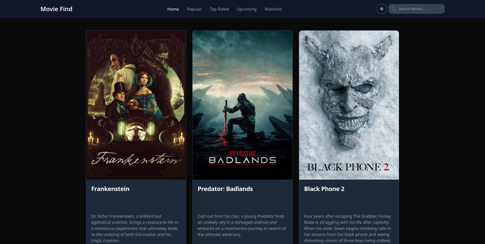

# Movie Find App



### **Live Demo:** [See It in Action](movie-find-application.netlify.app/)

An **enhanced** and **modernized** web application for discovering and exploring movie information.

This project is a complete rewrite and upgrade of the original **[Cinemate](https://github.com/ShubhamSarda/cinemate/)** application created by **[Shubham Sarda](https://github.com/ShubhamSarda)**. It migrates the original codebase to a more performant and maintainable modern stack.

## Key Enhancements

- **Next.js Migration:** Full migration from **React.js** to the **Next.js** framework for better performance, built-in routing, and improved SEO capabilities.
- **Type Safety:** Adoption of **TypeScript** across the entire codebase for enhanced type safety, maintainability, and fewer runtime errors.
- **Improved UI/UX:** A cleaner, more intuitive, and fully **responsive design** that provides a great experience on all devices.
- **Cleaner Architecture:** Better folder structure, modular components, and a cleaner architecture for easier understanding and future contributions.
- **State Management:** Implementation of **Redux Toolkit** for predictable and scalable global state management.
- **Performance:** Faster page rendering and improved loading times due to Next.js features and code optimization.

## Tech Stack

The application is built using the following modern technologies:

| Technology |
| :--- |
| **Next.js** |
| **TypeScript** |
| **Tailwind CSS** |
| **TMDB API** |

## Getting Started

Follow these instructions to set up the project locally.

### Prerequisites

You must have **Node.js** and **npm** installed on your machine.

### 1. Installation:

Clone the repository and install the necessary dependencies:

```bash
git clone [https://github.com/arminayaz/movie-find.git](https://github.com/arminayaz/movie-find.git)
cd movie-find
npm install
npm run dev
```

### 2. Environment Variables:
The app requires an API key from [TMDB](https://www.themoviedb.org/) to fetch movie data.

- 1. Copy the example environment file:

```bash
cp .env.example .env.local
```
- 2. Open .env.local and fill in your TMDB API key:

```
TMDB_API_KEY = YOUR_TMDB_API_KEY_HERE
```

- 3. Running the Development Server
To start the app in development mode:

```bash
npm run dev
```

### Building for Production:

To create an optimized production build:

```
npm run build
npm start
```

## Acknowledgments

This project was created with the help of AI coding assistants (Gemini, ChatGPT, and Claude) for guidance and code improvement.

## License & Disclaimer

This project is intended for educational and portfolio purposes only.

- License: The license is published with explicit permission from the original author, Shubham Sarda. Redistribution, modification, or reuse by others needs the author's consent.

- Disclaimer: This project is inspired by the design aesthetic of the IMDB website but is not affiliated with or endorsed by Amazon company.
